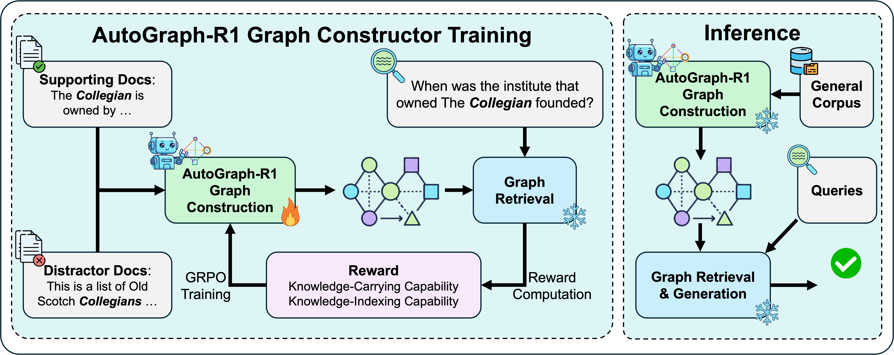

# AutoGraph-R1

**AutoGraph-R1** is a framework for constructing and leveraging knowledge graphs (KGs) for advanced retrieval-augmented generation (RAG). It consists of two main stages:

1. **Graph Constructor Training Stage**: Trains a model to build knowledge graphs from text corpora.
2. **Inference Stage**: Uses the trained model to construct KGs and perform RAG benchmarking.

This README provides step-by-step instructions to set up the environment, install dependencies, and run both stages.

## Project Overview

AutoGraph-R1 is the first framework to optimize knowledge graph (KG) construction for retrieval-augmented generation (RAG) using Reinforcement Learning (RL). It addresses the disconnect between KG construction and its downstream application by training a large language model (LLM) constructor to generate graphs that maximize task performance. By framing graph generation as a policy learning problem, AutoGraph-R1 uses novel task-aware reward functions—one for graphs as knowledge carriers and another as knowledge indices—to ensure the graphs are demonstrably useful for question answering (QA) tasks. For a detailed overview, refer to the project diagram:



## Prerequisites

Before setting up the environment, ensure you have the following:

- **Hardware**: A machine with a CUDA-compatible GPU. (For AMD or Ascend gpu, please refer to VeRL documentation)
- **Software**:
  - Python 3.9 or higher
  - CUDA drivers compatible with your GPU
  - Git for cloning repositories

## Setup Instructions

### 1. Environment Setup for Graph Constructor Training

The training stage requires setting up a CUDA environment and installing VeRL, PyTorch, and Transformers.

#### Step 1: Install CUDA
- Install the appropriate CUDA version for your GPU (Refer to VeRL for supported CUDA version). Refer to the [NVIDIA CUDA Toolkit documentation](https://developer.nvidia.com/cuda-downloads) for installation instructions.
- Verify the installation:
  ```bash
  nvcc --version
  ```

#### Step 2: Install VeRL
VeRL is used for the agent loop in the training stage. Follow these steps:

- Install VeRL according to your CUDA version. Refer to the [VeRL installation guide](https://verl.readthedocs.io/en/v0.5.x/start/install.html#install-from-custom-environment).
- For detailed instructions on setting up VeRL for the agent loop, see this [tutorial](https://github.com/zhaochenyang20/Awesome-ML-SYS-Tutorial/blob/703711904b3f69a187068916b29264c310f056cc/rlhf/verl/multi-turn/tool_examples/agent_loop.md) (This tutorial is written in chinese).

#### Step 3: Install PyTorch and Transformers
If you find the installed pytorch and transformers is not supporting your CUDA version you can reinstall PyTorch and the Transformers library in your Python environment
- For PyTorch, our testing environment is v2.7.1+cu12.6 [install link](https://pytorch.org/get-started/previous-versions/)
- For Transformers, it is 4.53.3

Ensure the PyTorch version is compatible with your CUDA setup. Check compatibility at the [PyTorch website](https://pytorch.org/get-started/locally/).

### 2. Environment Setup for Inference Stage

The inference stage uses an additional package for RAG, [AutoSchemaKG](https://github.com/HKUST-KnowComp/AutoSchemaKG).

#### Install Atlas-RAG
In the same Python environment, install the `atlas-rag` package:

```bash
pip install atlas-rag
```
Our version used is >=v0.0.4.post2.

## Running the Training Stage

**Deploy Embedding Model**
```bash
bash scripts/vllm_serve/qwen3-0.6b-emb.sh
```

### For 3B model training
For Graph Retriever
```bash
bash scripts/autograph-r1/run_qwen2.5-3b_instruct_graph.sh
```

For Graph-based Text Retriever
```bash
bash scripts/autograph-r1/run_qwen2.5-3b_instruct_with_distract-iterative-hipporag-2.sh
```

### For 7B model training
For Graph Retriever
```bash
bash scripts/autograph-r1/run_qwen2.5-7b_instruct_graph.sh
```

For Graph-based Text Retriever
```bash
bash scripts/autograph-r1/run_qwen2.5-7b_instruct_with_distract-iterative-hipporag-2.sh
```

## Running the Inference Stage

The inference stage involves two main tasks: constructing a knowledge graph (KG) using a fine-tuned language model and performing RAG benchmarking.

### 1. Knowledge Graph Construction
To construct a knowledge graph from a general corpus, run the following script:

```bash
python benchmark/autograph/custom_kg_extraction.py
```

- **Input**: Specify the input corpus in the script or via command-line arguments (refer to the script documentation for details).
- **Output**: The script generates a knowledge graph stored in the specified output directory.

### 2. RAG Benchmarking
The benchmarking process evaluates two retrieval methods: graph-based and text-based.

#### 2.1 Graph Retriever
Run the graph retriever benchmark:

```bash
python benchmark/autograph/benchmarking_graph.py
```

#### 2.2 Graph-Based Text Retriever
Run the text retriever benchmark:

```bash
python benchmark/autograph/benchmarking_text.py
```